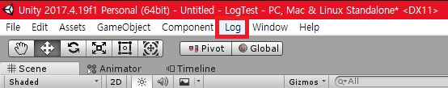
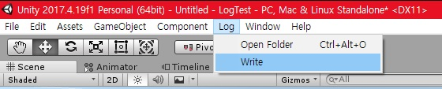
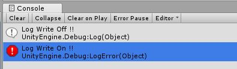
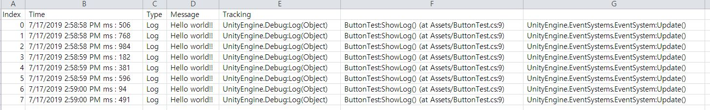

# UnityLog
UnityLog

## 개요

플레이 모드 상황에서 로그에 대한 기록을 진행한다.
CSV 형태로 제공 되며 엑셀을 통해서 검색 및 필터를 적용 하여 보다 편리한 디버깅을 제공하는데 목표가 있다.

## 설치 방법

1. 프로젝트 또는 UnityLog.unitypackage 패키지를 다운 받는다.

2. 본인 프로젝트에 로드 한다.

## 사용방법

1. 유니티 프로젝트 상단 메뉴에 Log 메뉴를 확인 할 수 있다.

2. Open folder, Write 메뉴가 있다.

    Open folder : CSV 파일들이 저장 되는 폴더를 연다 (Ctrl + Alt + o)

    Write : 플레이 모드에서 로그를 수집 할 지 선택한다. 콘솔 창에서 메시지를 확인 할 수 있다.

    
    - Log Write On !! : 플레이 모드 시 로그 수집 O
    - Log Write Off !! : 플레이 모드 시 로그 수집 X

## 결과물 예시

